# 📊 Workflow & Use Case — Billing Mitracom

## 1. Use Case Diagram

### 1.1 Aktor Sistem

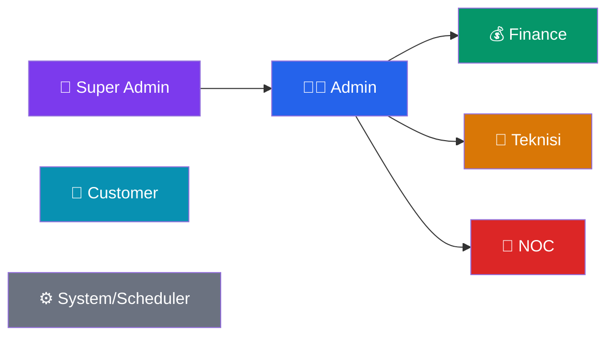

| Aktor | Deskripsi | Akses |
|-------|-----------|-------|
| **Super Admin** | Full control | Semua fitur + user management |
| **Admin** | Operasional harian | Semua kecuali user management |
| **Finance** | Keuangan | Dashboard, billing, invoice, transaksi |
| **Teknisi** | Lapangan | Dashboard, pelanggan, tiket, WO, jaringan |
| **NOC** | Network Operations | Dashboard, pelanggan, jaringan, GenieACS |
| **Customer** | Pelanggan (portal) | Portal self-service + mobile API |
| **System** | Scheduler/Cron | Auto-generate invoice, reminder, suspend |

---

### 1.2 Use Case — Admin Panel

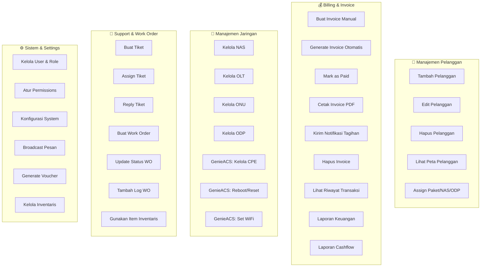

### 1.3 Use Case — Customer Portal

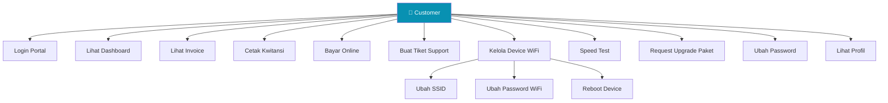

### 1.4 Use Case — System Automation

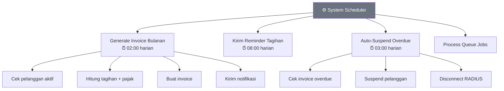

---

## 2. Workflow Diagram

### 2.1 Alur Utama — Lifecycle Pelanggan

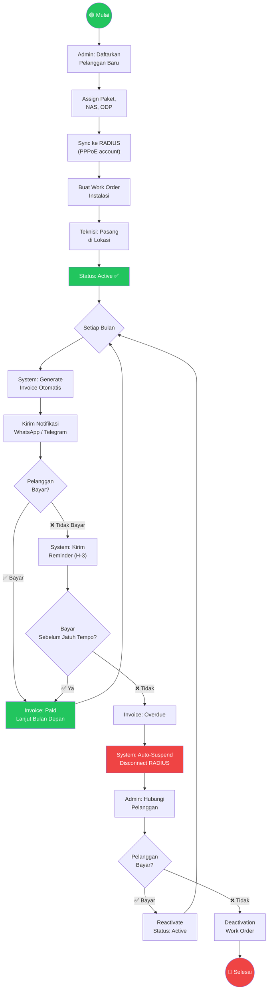

### 2.2 Alur Pembayaran Online

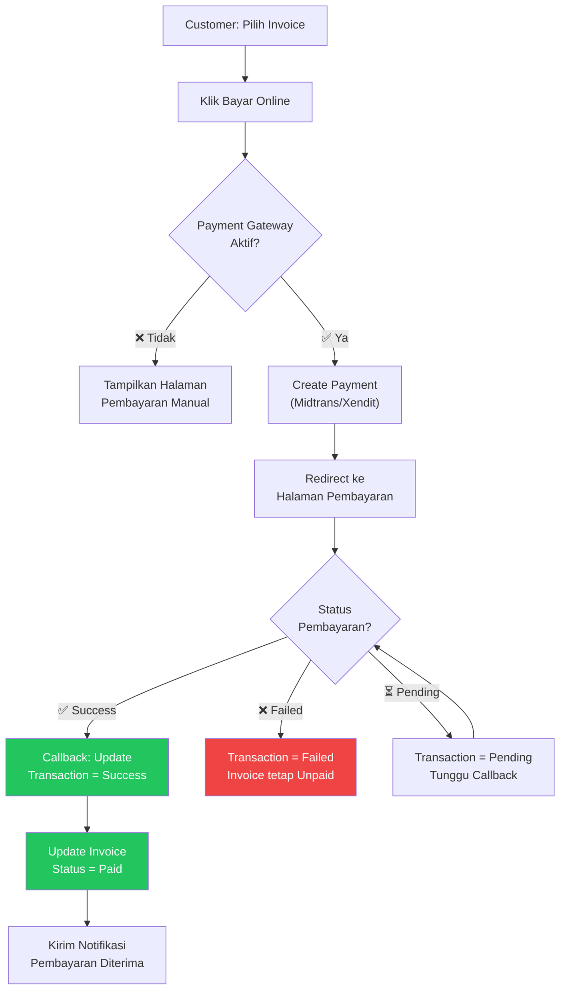

### 2.3 Alur Work Order

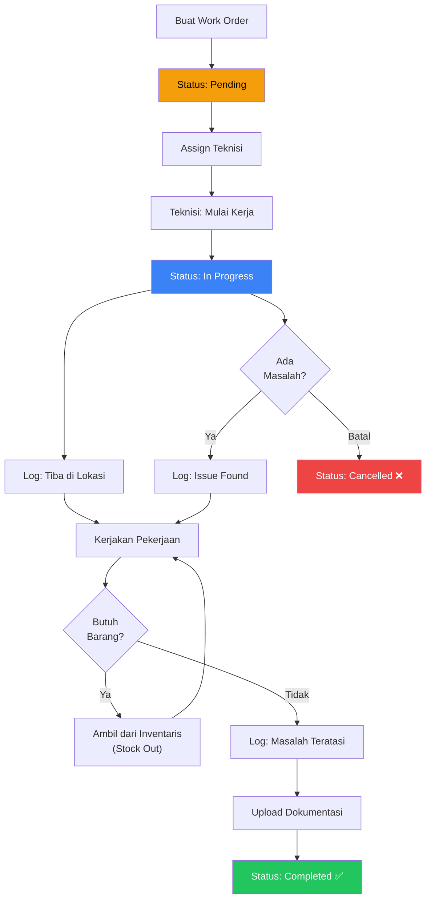

### 2.4 Alur Tiket Support

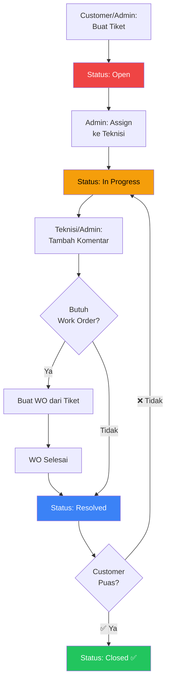

### 2.5 Alur Inventaris

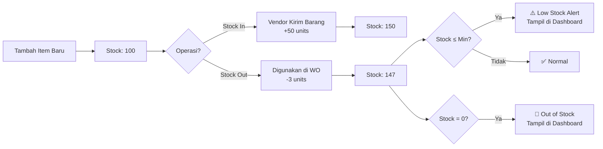

---

## 3. Arsitektur Sistem

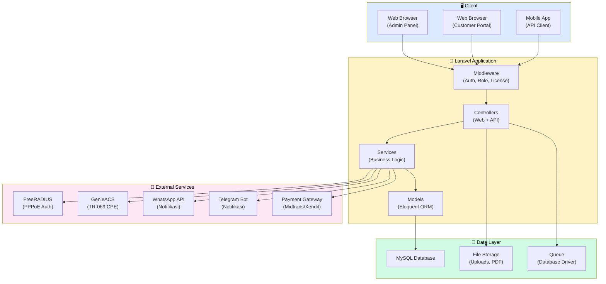

---

## 4. Matriks Hak Akses

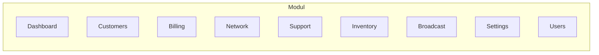

| Modul | Super Admin | Admin | Finance | Teknisi | NOC |
|-------|:-----------:|:-----:|:-------:|:-------:|:---:|
| Dashboard | ✅ | ✅ | ✅ | ✅ | ✅ |
| Customers | ✅ | ✅ | 👁️ | ❌ | ✅ |
| Plans | ✅ | ✅ | 👁️ | ❌ | ✅ |
| Invoices | ✅ | ✅ | ✅ | ❌ | ❌ |
| Transactions | ✅ | ✅ | ✅ | ❌ | ❌ |
| Reports | ✅ | ✅ | ✅ | ❌ | ❌ |
| NAS/OLT/ONU/ODP | ✅ | ✅ | ❌ | ✅ | ✅ |
| GenieACS | ✅ | ✅ | ❌ | ✅ | ✅ |
| Tickets | ✅ | ✅ | ❌ | ✅ | ✅ |
| Work Orders | ✅ | ✅ | ❌ | ✅ | ✅ |
| Inventory | ✅ | ✅ | ❌ | ❌ | ❌ |
| Broadcast | ✅ | ✅ | ❌ | ❌ | ✅ |
| Vouchers | ✅ | ✅ | ❌ | ❌ | ✅ |
| Settings | ✅ | ✅ | ❌ | ❌ | ❌ |
| Users & Roles | ✅ | ❌ | ❌ | ❌ | ❌ |

> 👁️ = View only, ✅ = Full access, ❌ = No access

---

## 5. Entitas Data (ERD Simplified)

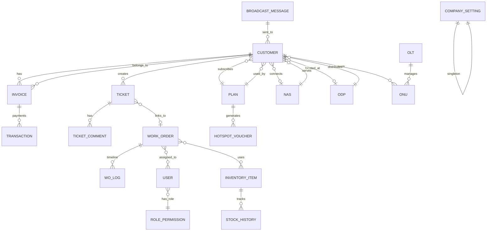
